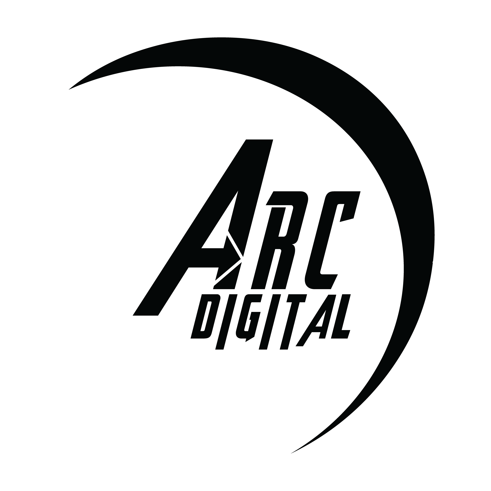

<div align="center">
  
  <h1>Arc Digital</h1>
  <p><strong>Modern Landing Page for a Creative Digital Agency</strong></p>
</div>

---

## About Arc Digital Landing page

Arc Digital’s landing page is a sleek, responsive, and animated interface built to represent the creative energy and digital capabilities of the Arc Digital agency.

This site showcases services, team members, and key offerings with a modern aesthetic and smooth interactivity to build trust and impress visitors. It’s built with performance, scalability, and responsiveness in mind.

---

## Tech Stack

Arc Digital's landing page uses the following technologies:

- **React.js** – Component-based frontend framework
- **Tailwind CSS** – Utility-first CSS framework for styling
- **Framer Motion** – Smooth and customizable animations
- **Vite** – Fast build tool and development server
- **GitHub / Render** – For version control and deployment

---

## Features

**Animated Hero Section** – Clean intro with motion effects  
 **Team Carousel** – Rotating, clickable team member showcase  
 **Responsive Layout** – Works great on all screen sizes  
 **Smooth Navigation & Scroll Effects**  
 **SEO & Performance Optimized**

---

## Installation & Setup

To run the project locally, follow these steps:

```bash
# Clone the repository
git clone git@github.com:rainbows-n-sushine/Arc-digital.git

# Navigate into the project folder
cd arc-digital

# Install dependencies
npm install

# Start the development server
npm run dev
```

# Here is the deployment server

https://arc-digital-1.onrender.com/
